# max8-workshop
Part of a fun-filled workshop at CuteLab

https://cutelab.nyc

# Intro

Hi. This is an up-and-running workshop about Max 8, the visual programming language for music and multimedia. It does not assume any knowledge of Max, but it also moves at a relatively fast pace. Hopefully, this will inspire new users, but also give seasoned pros some new reasons to explore the newest version of Max. Instead, it might simply be the wrong fit for everyone. The advantage of being a github repo is that we can always make it better later.

## What is Max 8

Max 8 is a visual programming language. That means that instead of writing lines of code, you connect together functional blocks called objects. Some people find this a more intuitive way to describe the kinds of computation common to interactive, multimedia systems. Max is especially good for trying out new ideas, and for connecting together different forms of input and output, like video to audio, or gesture to video.

The fundamental rule of Max—and indeed computer art in general—is that anything can be turned into a number, and numbers can be turned into anything else. As you can imagine, this is a very large creative space.

## What can you do with Max?

People use Max for all kinds of things. Some especially popular projects include audio-reactive visuals, new musical instruments, and live electronics. Here's a smattering of some cool stuff:

- https://www.youtube.com/watch?v=U9v-4VrSglE Leafcutter John is a musician working with Max. This piece uses a number of light sensors, along with some flashing handheld lights, to create a new musical instrument.
- https://www.youtube.com/watch?v=gvUpkknryaY Daito Manabe is an artist working on installations, compositions, and choreography, using as many new technologies as possible. Particles is a piece that uses Max to map the positions of a number of rolling physical components to various sound events.
- https://www.youtube.com/watch?v=BXlaSBo0KXs This piece, written for the reopening of the St. Pauli Elbtunnel in Hamburg, uses Max to coordinate the performance of 144 musicians all along the length of the tunnel.

## Getting started

Let's start by opening up Max. When you do that, you'll be greeted by this big blank canvas. You can do anything you want! So what should we do?

First, let's make a button. You can press b to make a button. Drag the button around to reposition it. Normally, this is the place where I talk about locking and unlocking the patch. You lock the patch to press the button, and unlock it to drag the button around. In Max 8 there's a swanky new feature called "Operate While Unlocked." In this mode, you hold down shift when you want to drag stuff around. It's totally up to you which one you want to use. 

Cool let's do something with that. Make an object called [random 50]. You press n to make a new object. This generates random numbers between 0 and 50. Now let's make an integer box. Press i to make this. Connect them all up. Now you can push the button to get a random number.

Let's also go up into the Debug menu and turn on Event Probe and Signal Probe. These will make our lives much easier later. You can hover over patchcords to see the most recent message that they sent.

Okay, let's do something with these random numbers. Let's hear some freaking sound already. Make an object called tri~. This is an oscillator, it generates an antialised triangle wave. Now make a floating point box (press f) and connect it to the tri~ object. Now let's make a scope~ (all of the objects that handle audio have yellow patch cables and are followed by the tilde) and connect it. Finally, turn on DSP by clicking on the little control in the bottom-right. You should see a wave displayed in the scope~. You can activate automatic mode, which may make it look better, but you might not be able to see when the frequency changes since the scope will adjust automatically.

Now connect the random number generator to the frequency box, and let's make some random frequencies. It doesn't work!? How come? Or at least, it sounds very low. Why is that? Let's fix it by converting MIDI to frequency. We can find the objec that does that by using search, which is way better in Max 8 than it was in other versions of Max.

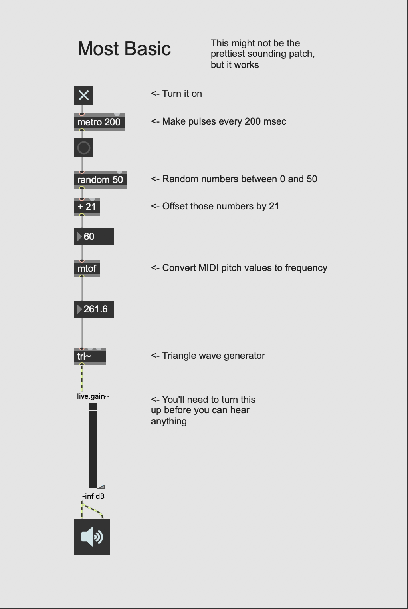

Next we can add a kslider, which will let us pick a note in some way other than randomly.

## Spreading tones, making textures.

Up to now, this is more or less where a lesson teaching Max 7 would have gone. Now we get to depart radically from that and do some really cool stuff. First, we gotta change some of the objects in our original patch into multichannel objects. So all of the objects that end with ~ are audio objects. If you prefix any of these with mc., they become multichannel audio objects. They will use bright blue patch cords, which can handle any number of channels.

You'll also need an mc.stereo~. Don't forget autogain, and don't forget the signal~ for pan. You might want to save this as a snippet, which can be handy.

Okay, now we can add the @chans attribute to tri~, which lets us specify how many channels of audio we want. Let's start with @chans 8. Now try sending the following messages:

"increment 75 220"
"harmonic 0.1 330"
"harmonic 1 55"
"deviate 50 330"

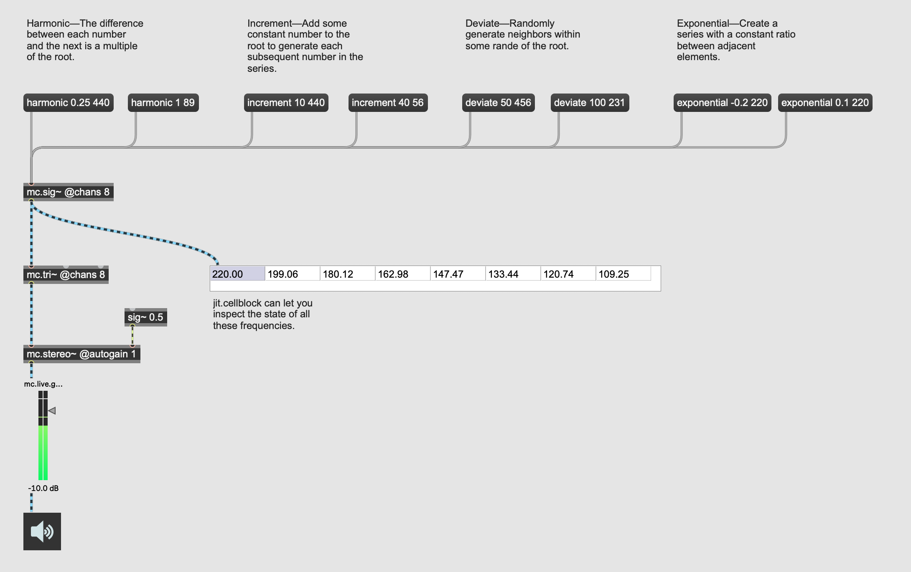

What do they sound like? Each of these creates a different distribution of frequencies, and those frequency relationships can be pleasing, disturbing, buzzy, etc. Using the kslider, along with the dollar notation, we can make a kind of instrument like this. 

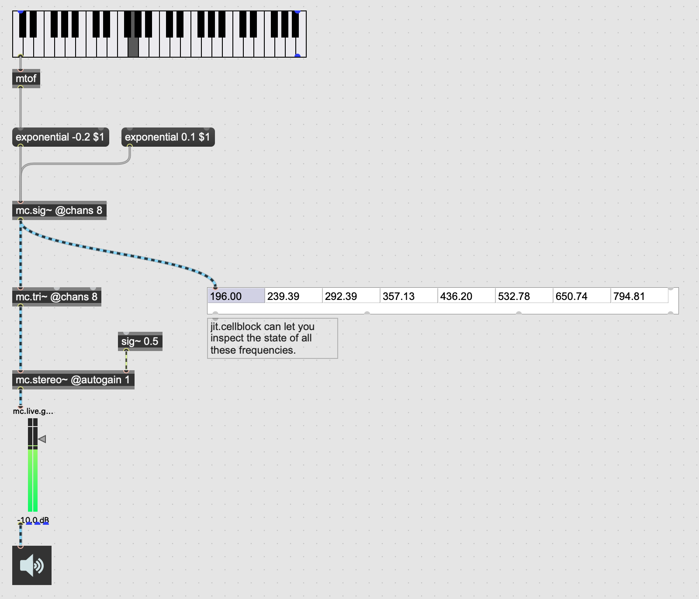

We can even use it to make some drone microcompositions.

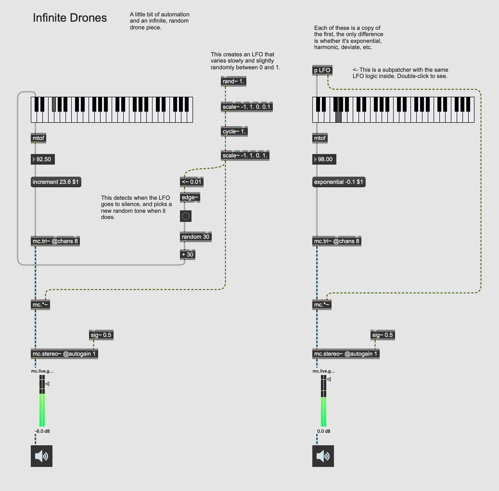

## From drones to voices

One thing that's actually been kind of tricky in previous versions of Max is something called voice allocation. There are a couple of new objects that work with MC to try to address this, and they're called mc.voiceallocator~ and mc.noteallocator~.

Let's look specifically at mc.voiceallocator~. If you send it a bang message, you'll notice that the rightmost outlet of this object sends out a number whenever it gets a message. This "round robin" number can be used with MC objects to make sure that each message goes to a different object.

Before we get into that, let's use something called the line~ object to make an envelope for our sound. Let's make an mc.tri~ @chans 8 and an mc.line~ @chans 8. Add in a multiply to multiply the envelope by the cycle~. If you've never seen something like this before, it's a super classic way to model sound. You've got a generator, and you shape it with an envelope, similar to what might happen if you had a piano, for example.

As you'll notice, this doesn't let us play more than one note at a time. You'll notice that it actually causes every voice to fire at once. We can use the target message to make just one voice fire. Finally, we can use mc.voiceallocator~ to create a round-robin for our voices. This in conjunction with "target $1" lets us build a poloyphonic instrument.

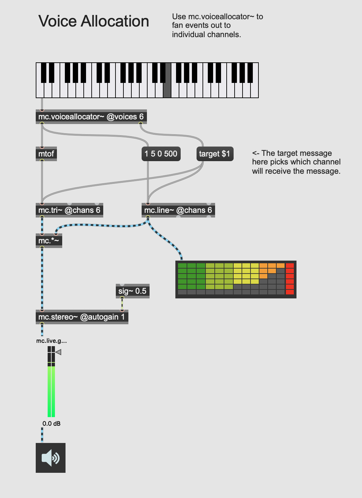

## Neat sound design

Okay, now I just want to show you another neat way that you can use some of this stuff. Of course, you don't have to use synthesized sounds with Max, you can also use recorded samples. There are a few different ways to do this, but a pretty typical one is to use groove~ and buffer~.

Start by copying the typical multichannel output that we had before. Next, let's make an object called buffer~. This is the object that will hold onto our audio. Buffer~ gets a name, which other objects can use to refer to it. Call this one "buffer~ snd1" or something. Next, connect a message box up to this buffer with contents like "replace anton.aif". This will fill the contents of the buffer with the audio file "anton.aif". You can also send the replace message with nothing after it to get a dialog that will let you replace the buffer contents with whatever you like.

Okay, let's actually hear the contents of that buffer. We can use the groove~ object for this. It takes the name of the buffer as its first argument. It takes a sig~ as input as well to set the speed of playback. So if you send sig~ 1 then it will play back at normal speed. 2 gives you double speed, and -0.5 will play backwards at half speed.

So let's put a couple pieces of knowledge together. We can use sig~ in conjunction with harmonize and deviate to play back sounds with a whole bunch of different speeds at once. Depending on the exact settings that we use here, and the particular audio file that we choose, we can get a whole bunch of interesting sounds and rich textures (particularly if we turn on looping). Playing with the number of channels is interesting too, you might find that fewer channels sounds much more interesting.

## Audio-reactive video

There's lots more to talk about here, but I want to take a break from this stuff to talk about video. When it comes to making videos in Max, you're kind of spoiled for choice. There are a bunch of old school Jitter objects, you can build your own shaders, you can layer together openGL objects, and I'm sure there are even more ways I haven't thought of yet. One really easy way to get started though is with something called Vizzie, which lets you connect together high level building blocks to build quick video patches.

Let's make a Vizzie patch that starts with getting some video input. If you like you can connect this straight to video output, which is pointless but you're still _allowed_ to do it. Okay, grab a pixl8r and you can make yourself pixels. Cool. Now you can take those pixels and mess with the brightness, contrast and saturation. I think this kind of thing can look very nifty with some lumakeying.

Okay, with that all working, you can start to tweak some of these parameters. Wouldn't it be neat if we could make it audio reactive? This is a whole big area, and there's a lot of tricks and techniques and slow, careful massaging. However, here's some easy stuff that tends to work kind of well.

`abs~ -> rampsmooth~ 1 5000 -> snapshot 16`

This gives you a 60 fps envelope follower, good for picking up the big drum hits in a nice percussive piece of audio.

`zerox~ + dspstate~ -> rampsmooth~ 1 5000 -> snapshot 16`

This is a quick and dirty measurement of the spectral centroid. Roughly, it's how the energy of the sound is distributed towards high versus low frequencies. So it can differentiate a cymbol from a kick, for example. 

One last trick, you can also make an accumulator with either of the two above techniques, which can give you a cool kind of automation that sort of changes more rapidly as the video changes. This works especially well with parameters that vary continuously, like rotation, since it means there's no jump when the parameter wraps back from 1 to 0.

See the included patch for some examples of how you might hook this up for your experimenting pleasure. This is just one way to do it. It's not that there are no right answers. Rather, all answers are right answers.

## Node for Max popcorn simulator

Do you know about Node? It's a very powerful and current tool for making applications with JavaScript. Max 8 has a tool for working with Node called node.script This lets you start Node scripts from your Max patcher. It also connects your Max patchers to npm, a huge repository of open source JavaScript code that can add lots of functionality.

There's a lot you can do here, but I want to focus on making a popcorn simulator.

Okay so when popcorn starts popping, it doesn't just pop randomly. At any point in time, each kernel has some probability of popping. So the density of pops over time actually follows something called a Poisson distribution. There's no such distribution available to us in Max, so we can pull one in using Node for Max.

First, save this patch. Next, create a new text file next to it. They need to be next to each other so that the Max patcher can find the JavaScript script. Let's test things out by adding some very simple code to the JavaScript that will do nothing more than print to the Max console.

Okay, now that we've done that, we can actually talk about doing something useful. Let's add a handler, so that when we send a bang do this node.script object, it replies with a bang.

Now, let's actually add the poisson-process. We can require it in our script, and then we can use it to generate events accoring to the API.

`script npm install poisson-process`

If we want to get fancy, we can add a handler that lets us change the interval. Here's what the code looks like.

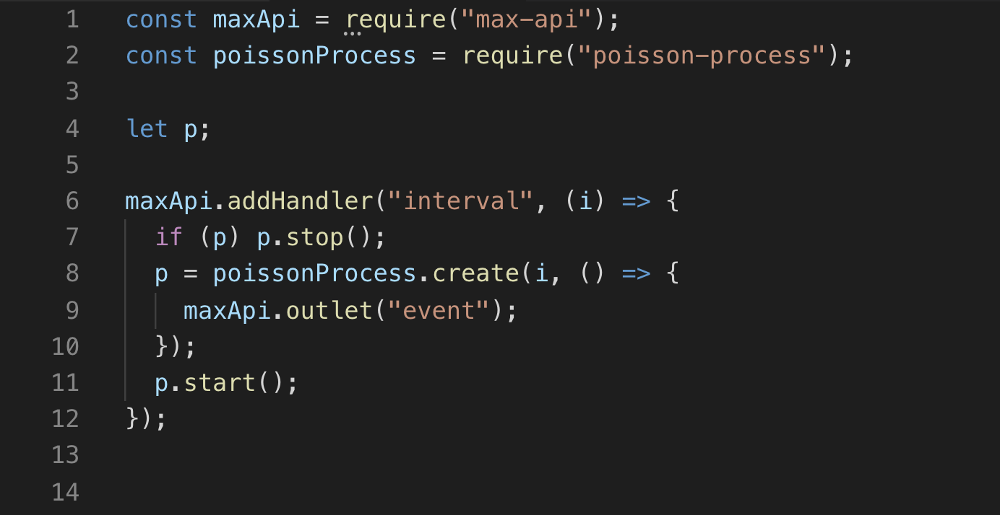

Finally, we can take this all together and use a noise~ object in conjunction with an envelope to make little popping sounds. If you want, you can pass these through some Max for Live devices to play with the quality of the sound. Here's the final patch.

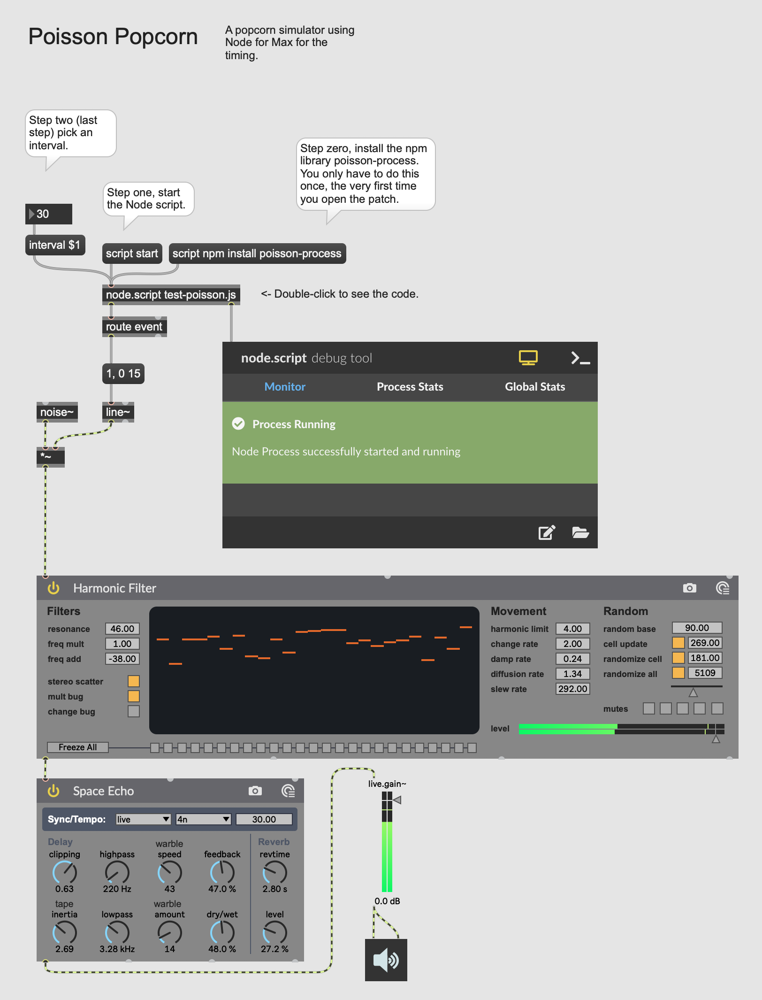

## Extra fun stuff

I can't believe we actually made it this far, that's incredible. Alright, first I just want to show you a cool object called jit.gl.bfg. If you're familiar with the jit.bfg object, it's the same, but with a couple of very key differences.

- It can zoom instead of just scalex and scaley, which centers the image rather than scaling from the corner.
- It has many more cool noise modes.
- It's on the GPU! This is the big one, really this is burying the lede.

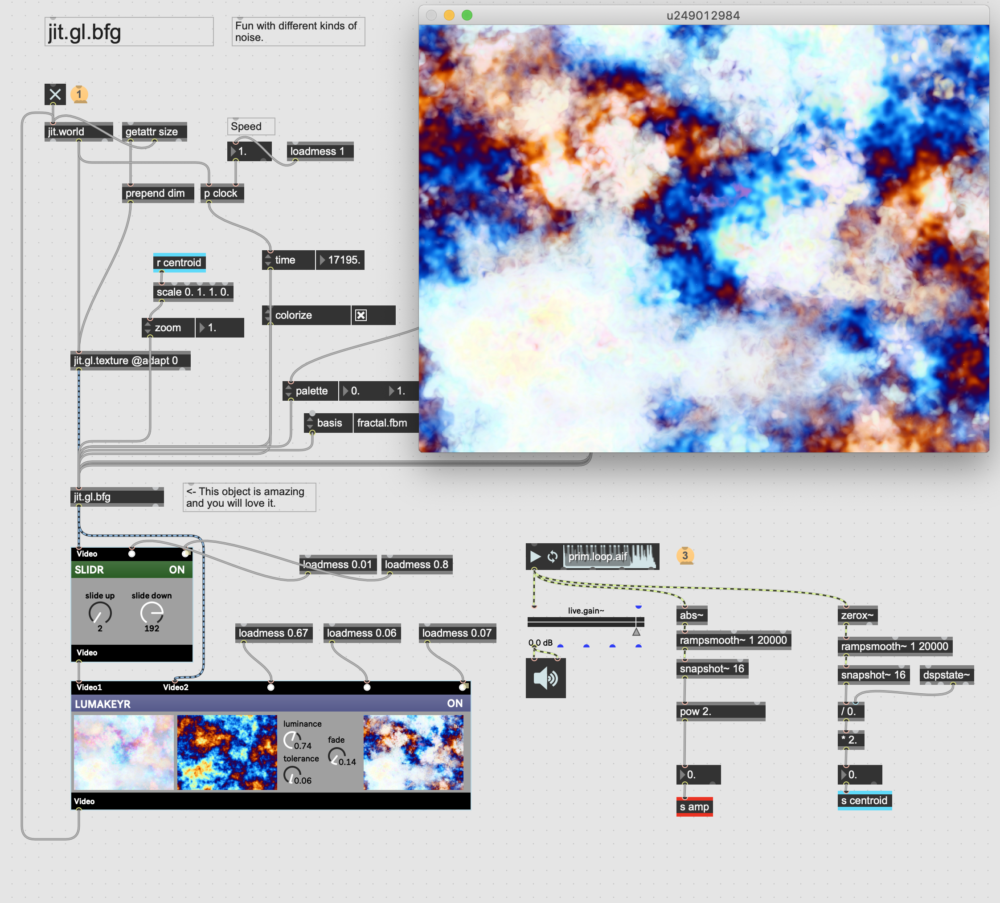

There's no way we made it all the way to here. I refuse to believe it. But if we did, let's talk about how to do granular-esque effects using mc and spreading. So the neatest bit of what I'm about to show you might look kind of boring, but given how hard it used to be it's acutally super cool. You can use spread with phasor~ to get waveforms that are just slightly out of phase.

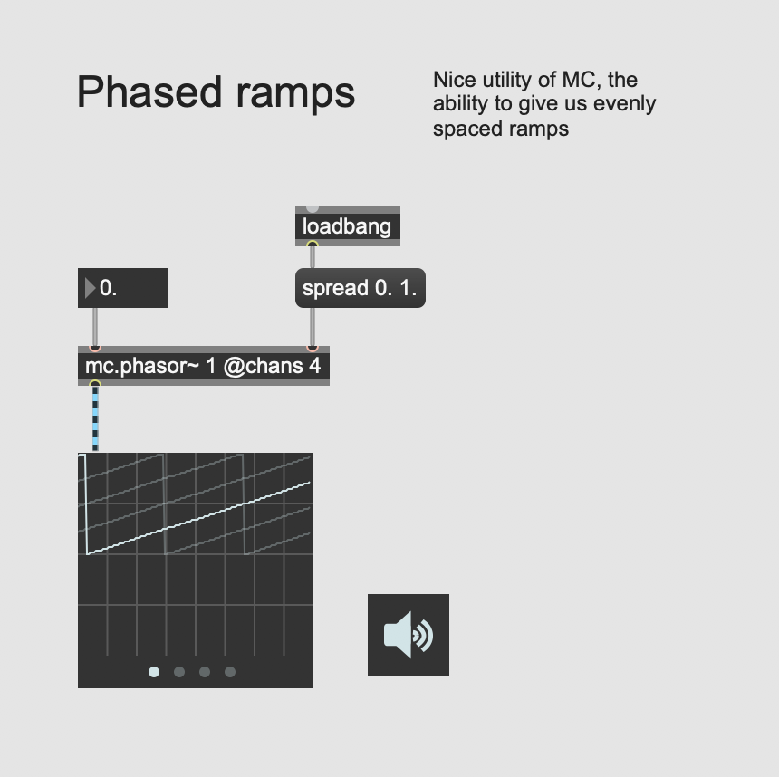

With this, it's possible to generate cosine ramps to avoid clicking when the ramps wrap back around.

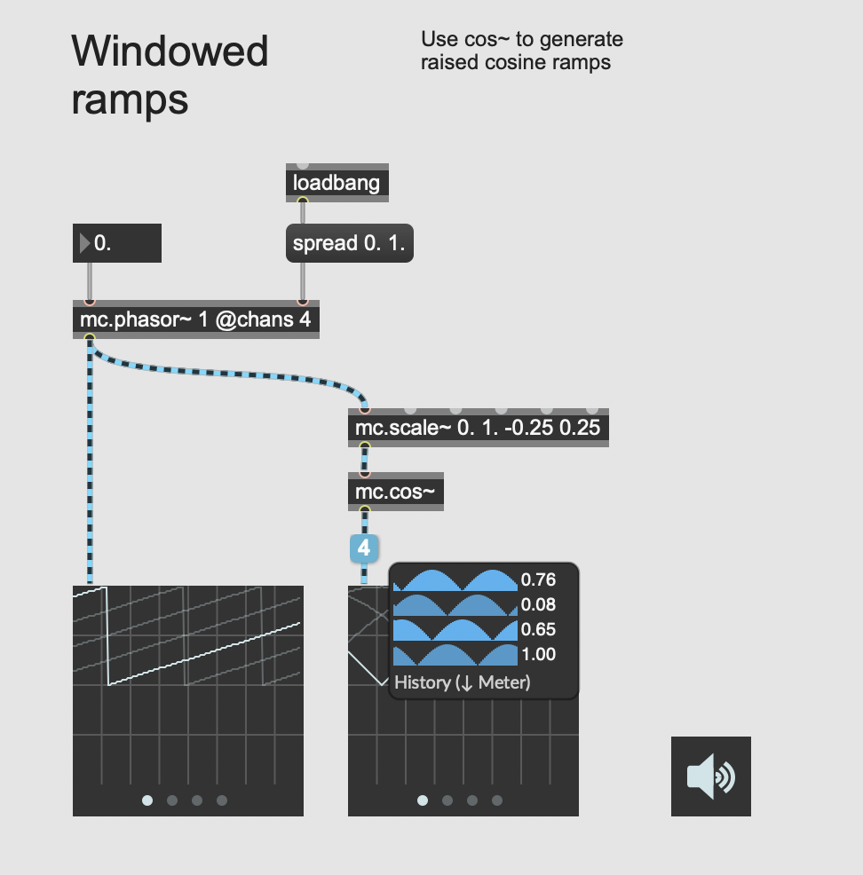

Next of course the fun thing to do is to use this with play~ in order to do some granular sampling.

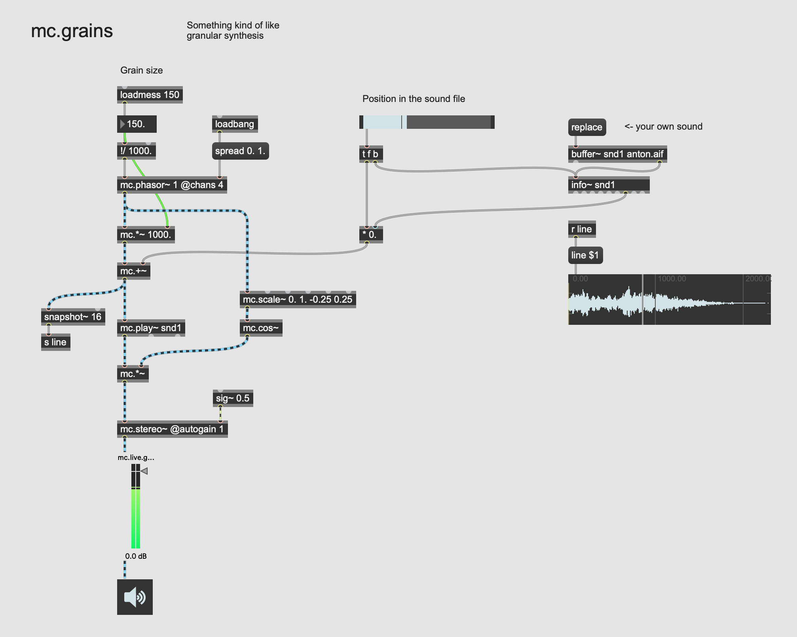

Finally, try opening up the mayonnaise example. Basically, granular synthesis plus autotune is cool.

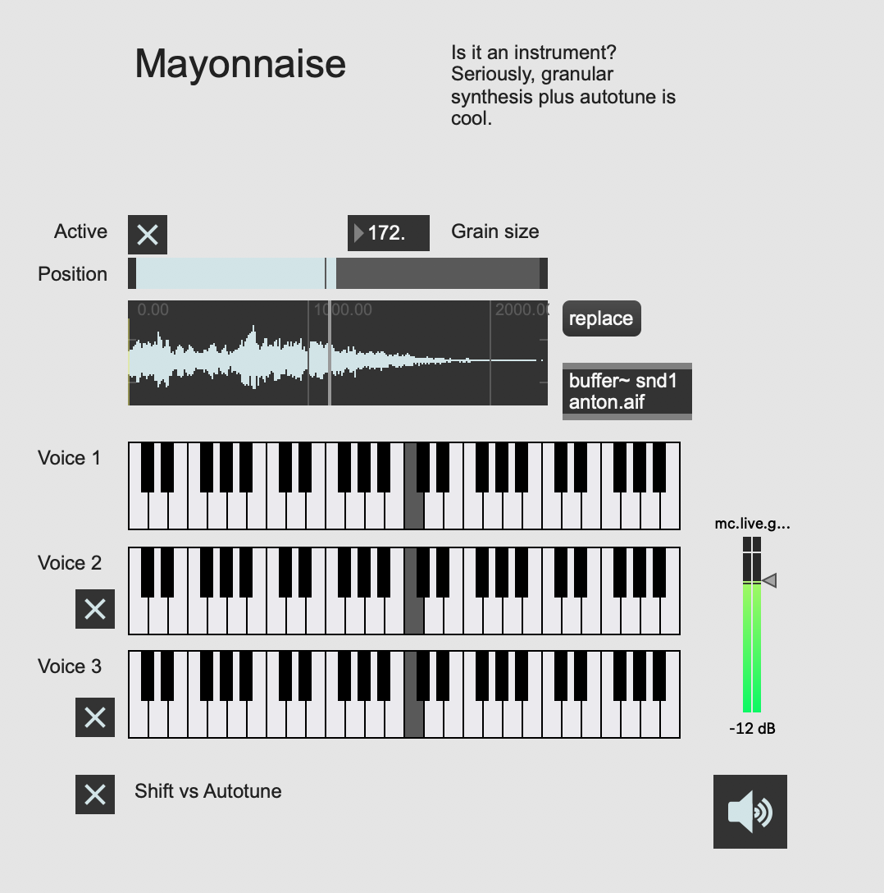

